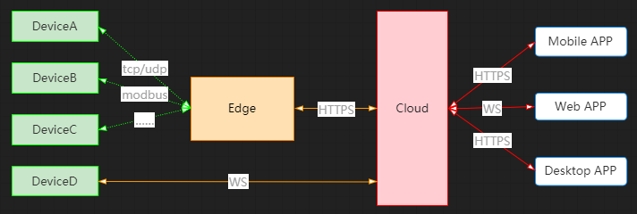

# Gm IoT Platform

**Gm IoT Platform** is a complete **infrastructure** based on the **.NET 6** to create **iot edge gateway** and **iot cloud** by following the software development **best practices** and the **latest technologies**.

# Stats


## Getting Started


### Quick Start

Install the gm iot cloud:

````bash
> 
````

Create a new solution:

````bash
> 
````


## What Gm Provides?

Gm provides a **full stack developer experience**.

### Architecture



### Infrastructure


